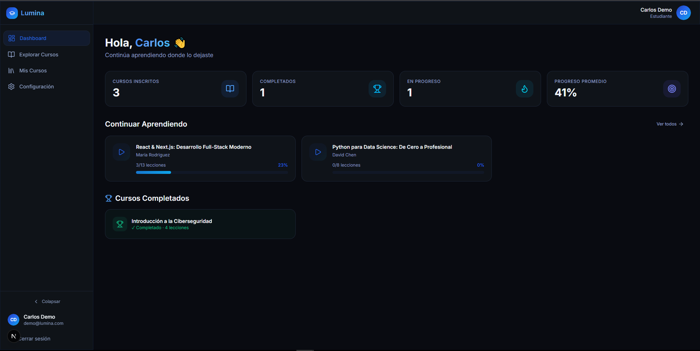
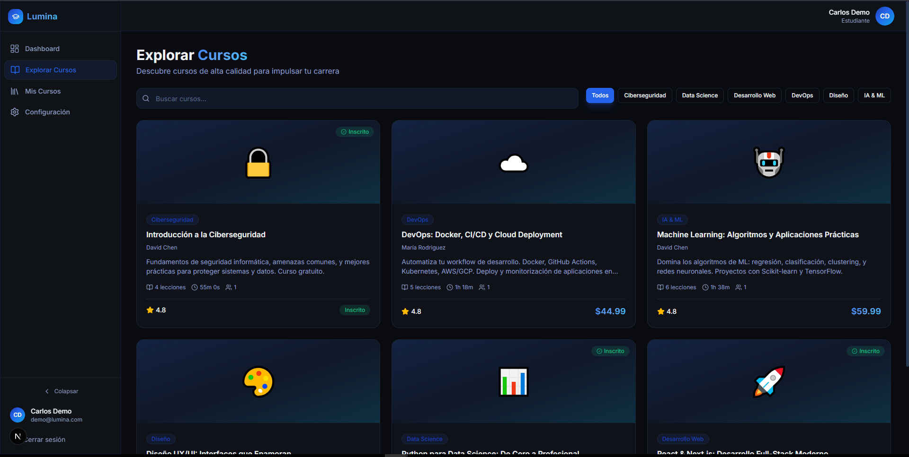
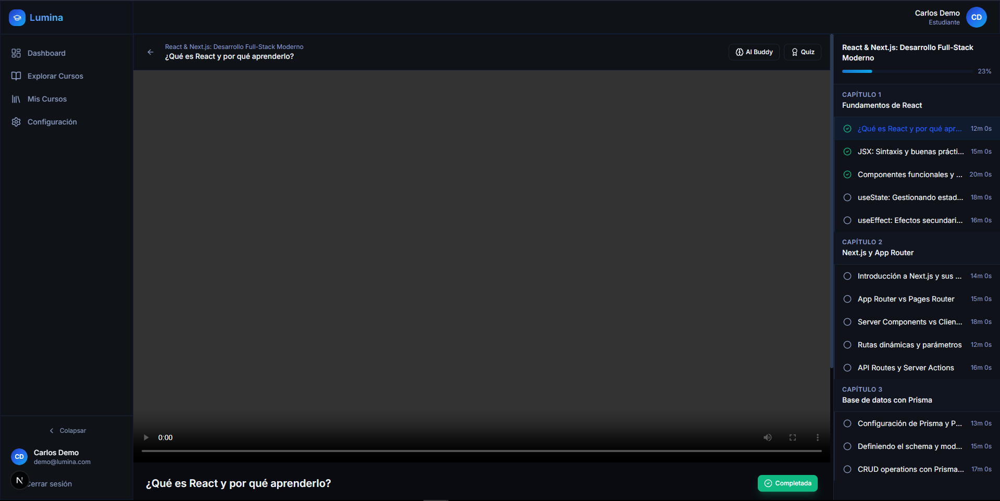

# 🎓 Lumina Academy - Plataforma de E-Learning Full-Stack

Lumina Academy es una solución integral de aprendizaje en línea diseñada para ofrecer una experiencia educativa fluida tanto para instructores como para estudiantes. Este proyecto demuestra capacidades avanzadas en manejo de flujos de usuario, contenido multimedia y arquitecturas modernas.

---

## 🖼️ Vista Previa del Proyecto

| Dashboard del Estudiante | Catálogo de Cursos | Reproductor de Clases |
| :---: | :---: | :---: |
|  |  |  |

## 🚀 Características Principales

* **Gestión de Cursos:** Los instructores pueden crear, editar y publicar cursos con múltiples lecciones de forma intuitiva.
* **Streaming de Video:** Integración optimizada para la visualización de clases en video sin interrupciones.
* **Pasarela de Pagos:** Sistema de inscripciones configurado para el acceso a contenido premium (ideal para monetizar contenido).
* **Panel de Estudiante:** Seguimiento del progreso en tiempo real, acceso a materiales descargables y gestión de perfil personal.
* **Diseño Responsivo:** Interfaz 100% adaptable a dispositivos móviles, tablets y computadoras de escritorio.

## 🛠️ Stack Tecnológico

* **Frontend:** Next.js (App Router), TypeScript, Tailwind CSS para estilos modernos.
* **Backend:** Node.js con API Routes integradas en Next.js.
* **Base de Datos:** PostgreSQL gestionado con Prisma ORM para consultas eficientes y seguras.
* **Despliegue:** Optimizado para Vercel.

---

## 📐 Valor Agregado (Freelance Focus)
Este proyecto no es solo código; es un producto funcional que resuelve problemas de:
1.  **Escalabilidad:** Preparado para recibir cientos de cursos y miles de alumnos.
2.  **SEO:** Renderizado del lado del servidor (SSR) para que los cursos aparezcan en buscadores.
3.  **Seguridad:** Validación estricta de datos y manejo seguro de sesiones de usuario.

---

<details>
  <summary>🛠️ <b>Instrucciones de Instalación (Para Desarrolladores)</b></summary>

### Pasos para configurar el entorno local:

1.  **Clonar el repositorio:**
    ```bash
    git clone [https://github.com/AndressCoronel/lumina-academy.git](https://github.com/AndressCoronel/lumina-academy.git)
    cd lumina-academy
    ```

2.  **Instalar dependencias:**
    ```bash
    npm install
    ```

3.  **Configurar variables de entorno:**
    Crea un archivo `.env` en la raíz del proyecto y añade tus credenciales:
    ```env
    DATABASE_URL="tu_url_de_postgresql"
    # Añade aquí tus claves de Auth y Cloudinary/Mux si aplica
    ```

4.  **Base de Datos (Prisma):**
    ```bash
    npx prisma generate
    npx prisma db push
    ```

5.  **Iniciar modo desarrollo:**
    ```bash
    npm run dev
    ```
</details>

---
Desarrollado por **[Andres Coronel](https://github.com/AndressCoronel)** *Disponible para proyectos freelance y colaboraciones de desarrollo web.*